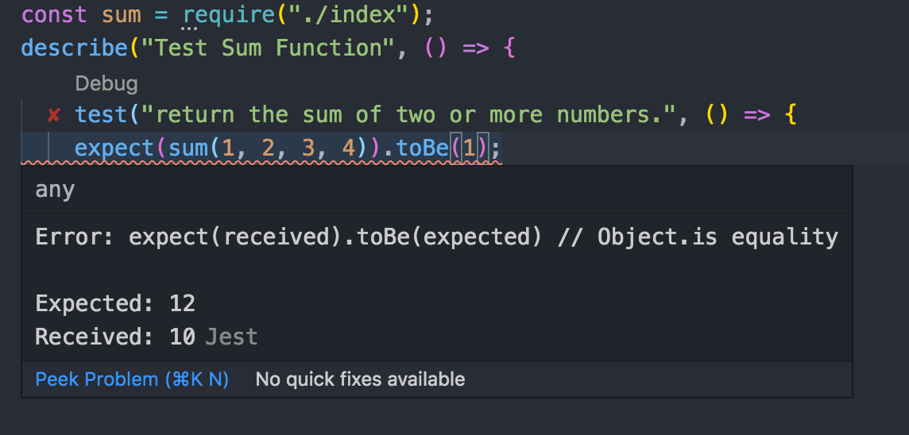
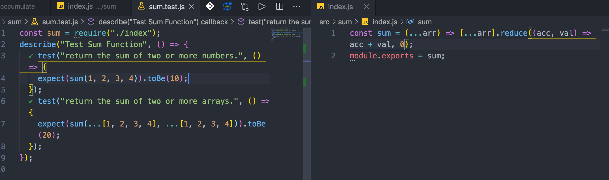

# Jest

## 环境搭建

```bash
yarn add jest --dev
```

添加到 package.json 中

```json
{
  "scripts": {
    "test:unit": "jest"
  },
  "devDependencies": {
    "jest": "^24.8.0"
  }
}
```

## Mock 使用

mock 是一种通过用可以控制和检查的对象替换依赖项来隔离测试主题的技术。

为什么需要 mock 函数呢？在项目中，一个模块的方法内常常会去调用另外一个模块的方法。在单元测试中，我们可能并不需要关心内部调用的方法的执行过程和结果，只想知道它是否被正确调用即可。

- 捕获函数的调用情况
- 设置函数返回值
- 改变函数的内部实现


我们可以通过下面的 api 进行 mock 函数的创建：

- jest.fn() mock 一个函数

```js
test("returns undefined by default", () => {
  const mock = jest.fn();

  let result = mock("foo");

  expect(result).toBeUndefined();
  expect(mock).toHaveBeenCalled();
  expect(mock).toHaveBeenCalledTimes(1);
  expect(mock).toHaveBeenCalledWith("foo");
});
```

- jest.mock() mock 一个模块
- jest.spy() 用于监听模块行为

### mock 单个函数

#### 一个长轮询工具函数

源代码：

```js
/**
 * @class PollingAction
 * @param {Function}  callback[回调函数]
 * @param {Number}  time[轮询时间]
 * @param {immediate}  immediate[是否立即执行回调函数]
 * @description  通过给定的TIME进行轮询操作
 */
export default class PollingAction {
  constructor(callback, time = 1000, immediate = false) {
    // 执行状态
    this.running = false;
    // 轮询间隔
    this.time = time;
    // 是否立即执行
    this.immediate = immediate;
    // callback判断
    if (callback) {
      if (typeof callback === "function") {
        this.callback = callback;
      } else {
        throw new Error("参数1 必须是个函数");
      }
    } else {
      this.callback = null;
    }
    // timer控制
    this.timer = null;
  }
  // 执行轮询
  start() {
    // 是否立即执行
    if (this.immediate) {
      this.callback && this.callback();
    }
    this.running = true;
    const onAction = () => {
      this.timer = setTimeout(() => {
        if (this.running) {
          try {
            this.callback && this.callback();
          } catch (error) {
            console.log(error);
            this.cancel();
          }
          return onAction();
        } else {
          return;
        }
      }, this.time);
    };
    return onAction();
  }
  // 取消轮询
  cancel() {
    this.running = false;
    this.timer && clearTimeout(this.timer);
    this.timer = null;
  }
}
```

源代码主义看输入的参数以及功能函数如取消、启动，这样更方便我们写测试用例。下面是测试用例：

```js
import PollingAction from "@/utils/pollingAction";
// jest.useFakeTimers();
describe("测试 pollAction轮询类", () => {
  beforeEach(() => {
    return jest.useFakeTimers();
  });

  test("测试非立即执行轮询", () => {
    const time = 1000;
    const callback = jest.fn();
    const po = new PollingAction(callback, time, false);

    // 触发轮询
    po.start();

    // 此刻不应该触发回调，1000ms 后才触发
    expect(callback).not.toBeCalled();

    // 有2种时间快进方法
    // jest.advanceTimersByTime(1000);
    jest.runOnlyPendingTimers();

    expect(callback).toBeCalled();
    expect(callback).toHaveBeenCalledTimes(1);
    expect(setTimeout).toHaveBeenLastCalledWith(expect.any(Function), time); // 设置触发时机

    // 消耗时间
    jest.runOnlyPendingTimers();
    expect(callback).toHaveBeenCalledTimes(2); // 第2次触发
    expect(setTimeout).toHaveBeenLastCalledWith(expect.any(Function), time);

    // 取消轮询
    po.cancel();
    jest.runOnlyPendingTimers();
    expect(callback).toHaveBeenCalledTimes(2); // po.cancel 生效，回调仍然只执行 2 次
  });

  test("测试立即执行轮询", () => {
    const time = 1000;
    const callback = jest.fn();
    const po = new PollingAction(callback, time, true);

    po.start();

    // start 立马执行回调
    expect(callback).toBeCalled();

    jest.runOnlyPendingTimers();

    expect(callback).toHaveBeenCalledTimes(2);
    expect(setTimeout).toHaveBeenLastCalledWith(expect.any(Function), time);

    po.cancel();
    jest.runOnlyPendingTimers();
    expect(callback).toHaveBeenCalledTimes(2);
  });
});
```

注意 Jest 通过 `jest.fn()`来模拟一个函数，后面就可以实用 toHaveBeenCalledxxx 这些 api 方便我们调用函数了。

### mock 整个包

#### 一个异步请求用户信息的例子

待完成描述部分。建议直接去看附带的 demo，example/04-jest/mock-async 部分。

## 添加 TypeScript 支持

[TypeScript](http://www.typescriptlang.org/) 是 JavaScript 的一个超集，主要提供了类型系统和对 ES6 的支持，它由 Microsoft 开发，[代码开源于 Github 上](https://github.com/Microsoft/TypeScript)。

example/03-Jest/typeScript 目录

```bash
|--src
|--|--utils
|--|--|__math.ts
|--tests
|  |__math.spec.ts
```

1. 安装包 `yarn add typescript --dev`，然后把 `.js` 改为 `.ts` 扩展名，并根据 TypeScript 语法编写逻辑代码。

Before

```js
// math.js
export const sum = function(a, b) {
  // 类型判断
  if (
    Object.prototype.toString.call(a) !== "[object Number]" ||
    Object.prototype.toString.call(b) !== "[object Number]"
  ) {
    return null;
  }
  return a + b;
};

export const mul = (a, b) => a * b;
export const sub = (a, b) => a - b;
export const div = (a, b) => a / b;
```

```js
// math.spec.js
import { sum } from "../utils/math";
describe("test math function", () => {
  it("Adding 1 + 1 equals 2", () => {
    expect(sum(1, 1)).toBe(2);
  });
});
```

After

```ts
// math.ts //  TypeScript => 是用来定义函数的，函数左边是似乎如类型
export const sum: (a: number, b: number) => number = function(
  a: number,
  b: number
): number {
  return a + b;
};
export const mul: (a: number, b: number) => number = function(
  a: number,
  b: number
): number {
  return a + b;
};
export const sub: (a: number, b: number) => number = function(
  a: number,
  b: number
): number {
  return a + b;
};
export const div: (a: number, b: number) => number = function(
  a: number,
  b: number
): number {
  return a + b;
};
```

```ts
// math.spec.ts
import { sum } from "../src/utils/math";
describe("test math function", () => {
  it("Adding 1 + 1 equals 2", () => {
    expect(sum(1, 1)).toBe(2);
  });
});
```

2. 在与 `package.json` 同目录下新增 `tsconfig.json`，添加 TypeScript 配置。

```js
{
  "compilerOptions": {
      "target": "es5",
      "strict": true,
  },
  "include": [
      "src/**/*",
      "tests/**/*"
  ],
  "exclude": [
      "node_modules",
  ]
}
```

这个时候使用 `tsc src/utils/math.ts` 可以成功对 ts 文件进行编译。

3. 使用 Jest 测试 TypeScript 代码需要借助 `ts-jest` 解析器，而且需要 `@type/jest` 类型声明，避免找不到如 `describe` 模块。注意的是，如果在上述文件 `tsconfig.json` 中声明了 `types` 字段且不为空，这时候需要把 `jest` 字段添加进 `types` 里，这个设置是告诉 TypeScript 从 `@type` 包中寻找哪些声明文件。

所以需要安装依赖：
`yarn add ts-jest @types/jest --dev`

然后修改 `jest.config.js` 配置文件，将 ts 文件解析器设置为 `ts-jest`。

```js
// jest.config.js
module.exports = {
  collectCoverage: true,
  transform: {
    "^.+\\.tsx?$": "ts-jest",
  },
};
```

另外，在 `package.json` 添加 scripts 测试命令。

```json
{
  "name": "typeScript",
  "version": "1.0.0",
  "description": "jest + ts",
  "main": "index.js",
  "author": "Jecyu",
  "license": "MIT",
  "scripts": {
    "test": "jest"
  },
  "devDependencies": {
    "@types/jest": "^25.1.2",
    "jest": "^25.1.0",
    "ts-jest": "^25.2.0",
    "typescript": "^3.7.5"
  },
  "dependencies": {}
}
```

最后，运行 `yarn test` 即可测试 TypeScript 代码。

## VSCode Jest 插件，让测试结果更快呈现

除了上面在项目中安装依赖包测试外，我们还可以安装 Jest 插件，先写好测试用例，然后一边实现一边查看测试的结果：




这样基本可以解决一些比较简单的测试用例，方便快捷，也不用安装依赖包。



双窗口开发查看。

## 在 VSCode 中调试 Jest

如何测试驱动开发，最近在实现 Web 性能优化的 demo 中有了新的想法。比如要实现一个树类来说可以用 UML 图画出来，然后给该类或方法写出一些常见的的用法，也就是单元测试用例。在实现的过程中，可以对单元测试用例进行不断调试反馈。那如何在 VSCode 调试 Jest 呢：

在项目根目录下，新建 `.vscode` 文件夹，新建文件 `launch.json`，然后复制下面的代码：

```json
{
  "version": "0.2.0",
  "configurations": [
    {
      "name": "Debug Jest Tests",
      "type": "node",
      "request": "launch",
      "runtimeArgs": [
        "--inspect-brk",
        "${workspaceRoot}/node_modules/.bin/jest",
        "--runInBand"
      ],
      "console": "integratedTerminal",
      "internalConsoleOptions": "neverOpen",
      "port": 9229
    }
  ]
}
```

然后在对应的测试文件设置断点调试即可，保证文件模块用的是 CommonJS 规范定义。

如果是测试文件采用了 ES Module 的，会出现下面描述的错误需要额外配置，下面我们看看如何让 Jest 支持 ES Module 模块。

## 让 Jest 支持 ES Module 模块

Jest 默认只支持 CommonJs 模块规范引入，如果你使用 ES Module 引入的话，则会报以下的错误：

```bash
 FAIL  packages/_utils/tests/base.spec.js
  ● Test suite failed to run

    Jest encountered an unexpected token

    This usually means that you are trying to import a file which Jest cannot parse, e.g. it's not plain JavaScript.

    By default, if Jest sees a Babel config, it will use that to transform your files, ignoring "node_modules".

    Here's what you can do:
     • To have some of your "node_modules" files transformed, you can specify a custom "transformIgnorePatterns" in your config.
     • If you need a custom transformation specify a "transform" option in your config.
     • If you simply want to mock your non-JS modules (e.g. binary assets) you can stub them out with the "moduleNameMapper" config option.

    You'll find more details and examples of these config options in the docs:
    https://jestjs.io/docs/en/configuration.html

    Details:

    /Users/linjy/Documents/Developer/Frontend/Easy-Wheels/packages/_utils/tests/base.spec.js:1
    import { type, isArray, slice, each, setAttr } from "../base";
           ^

    SyntaxError: Unexpected token {

      at Runtime._execModule (node_modules/jest-runtime/build/index.js:1179:56)
```

方案如下：

1. 需要安装必要的依赖：

```sh
yarn add --dev babel-jest @babel/core @babel/preset-env
```

或者

```sh
npm install --save-dev babel-jest @babel/core @babel/preset-env
```

2. 然后在根文件夹下创建 `babel.config.js` 文件，并复制下面的代码：

```js
// babel.config.js
module.exports = {
  presets: [
    [
      '@babel/preset-env',
      {
        targets: {
          node: 'current',
        },
      },
    ],
  ],
};
```

3. 确保在 `package.json` and `jest.config.js` 中 Jest 是默认配置。
4. Jest 会默认读取 babel 的配置，通过 base-jest 对 ES Module 的代码进行转换为 CommonJS。